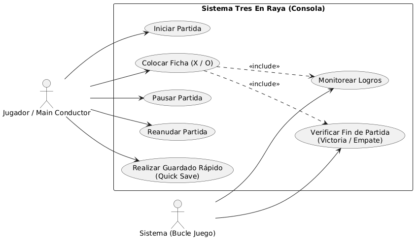

# Parcial3EvCarlosMarmol

# Simulador de Tres en Raya (Tic-Tac-Toe) - Motor de Juego por Consola

Este proyecto consiste en el desarrollo de un motor de videojuego minimalista para el clásico **Tres en Raya (Tic-Tac-Toe)** implementado en Java. La arquitectura está diseñada de forma desacoplada, abstrayendo la lógica del núcleo del juego de la capa de entrada de datos y preparación para una futura interfaz gráfica (GUI).

El sistema simula por consola el ciclo de vida completo de un juego (Game Loop), la gestión de estados, el procesamiento de comandos de usuario, un sistema de logros y la persistencia de datos mediante un sistema de guardado rápido (*Quick Save*).

---

## 🛠️ Arquitectura del Software

La arquitectura del sistema se limita estrictamente a **5 clases**, distribuyendo las responsabilidades mediante un patrón de diseño orientado a entidades y control por estados.

### Justificación de Clases y Responsabilidades

1. **`EntidadVideojuego` (Clase Abstracta):** Es la base del modelo del juego. Se justifica su uso para centralizar las propiedades espaciales comunes de cualquier objeto en pantalla (coordenadas `x`, `y`, ancho `w`, alto `h`), su `estado` dinámico y los recursos visuales (`imagenSimulada`). Esto asegura que el motor sea fácilmente escalable a entornos gráficos como Java Swing o JavaFX.
2. **`Ficha` (Clase Hija):** Extiende de `EntidadVideojuego`. En el contexto del Tres en Raya, representa la ocupación de una casilla por un jugador ('X' o 'O'). Implementa de forma concreta el método `actualizar()` para reportar su presencia estática en el tablero.
3. **`MotorJuego` (Clase Cerebro):** Centraliza el control total. Contiene la máquina de estados (`MENU`, `JUGANDO`, `PAUSA`, `GAME_OVER`), el ciclo de actualización principal (`actualizar()`), la matriz lógica del tablero (gestionada mediante la lista de entidades) y las reglas de negocio (verificación de victoria, empate y desbloqueo de logros).
4. **`GestorEntradas` (InputManager):** Encargado de desacoplar la lectura de comandos de la ejecución del motor. Traduce instrucciones simuladas en formato de texto string (ej. `"PONER_FICHA,1,1"`) en llamadas metodológicas directas hacia el `MotorJuego`.
5. **`Main` (Clase Conductora):** Orquesta la simulación. Alimenta al `GestorEntradas` con una batería de comandos secuenciales para demostrar, sin intervención manual ni bloqueos de lectura, el correcto funcionamiento de todas las directivas técnicas del enunciado.

---

## 🚀 Funcionalidades Implementadas

* **Control de Estado del Juego:** Transiciones lógicas y robustas entre estados, bloqueando acciones de juego si el motor se encuentra en `PAUSA` o `GAME_OVER`.
* **Simulación de Game Loop:** El método `actualizar()` recorre las entidades activas, procesa eventos ambientales e imprime logs de diagnóstico junto con un renderizado textual del tablero en cada iteración.
* **Gestión Dinámica de Entidades:** El motor añade instancias de `Ficha` a su colección interna dinámicamente a medida que los jugadores realizan movimientos válidos.
* **Sistema de Logros:** Monitoreo activo de condiciones de la partida en tiempo de ejecución. Dispara el logro *"Primer de muchos"* de manera automática al colocar la primera pieza.
* **Guardado Rápido Simulado (Quick Save):** Capacidad de exportar el estado exacto de la sesión (estado general, turno, número de movimientos y coordenadas de cada ficha) a una cadena formateada con estructura pseudo-JSON lista para persistencia.

---

## 💻 Instrucciones de Ejecución

1. Clona o descarga el repositorio con la estructura de paquetes correspondiente.
2. Compila los archivos fuentes de Java:
  

## Diagrama de clases

  

## Diagrama de casos

  

## Caso de Uso 1:  Colocar Ficha en Tablero

Nombre: CU-01 Colocar Ficha en Tablero

Objetivo: Permitir al jugador posicionar una ficha de su tipo ('X' o 'O') en una coordenada válida de la matriz de juego para avanzar en la partida.

Actor Principal :Jugador (Simulado a través de Main / GestorEntradas).

Precondiciones: El MotorJuego debe encontrarse estrictamente en estado JUGANDO y debe ser el turno del jugador que emite el comando.

Flujo Principal: 1. El jugador envía un comando de acción con las coordenadas deseadas (Ej: "PONER_FICHA,1,1"). 
2. El GestorEntradas intercepta el texto, extrae la fila y la columna, e invoca al MotorJuego.
3. El motor verifica que la celda destino esté vacía.
4. El motor crea una nueva instancia de Ficha con la posición y el turno correspondiente.
5. La ficha se añade a la lista de entidades y se incrementa el contador de movimientos.
6. El motor comprueba si el movimiento genera una condición de victoria o empate (Ver Flujos Alternativos).
7. El motor cambia el turnoActual al jugador contrario.
8. El ciclo actualizar() imprime el estado visual del tablero por consola.

Flujos Alternativos: 1. Celda ya ocupada: Si en el paso 3 se detecta que ya existe una entidad en esas coordenadas, el motor imprime un log de error (¡Movimiento inválido!), ignora la inserción y mantiene el turno actual.
2. Condición de Victoria alcanzada: Si en el paso 6 el método comprobarVictoria() devuelve true, el motor imprime el mensaje de Game Over por victoria del jugador actual y cambia el estado general a GAME_OVER
3. Condición de Empate alcanzada: Si en el paso 6 el contador de movimientos llega a 9 y no hay ganador, el motor imprime un mensaje de empate técnico y cambia el estado general a GAME_OVER.

Postcondiciones: El tablero cuenta con una entidad más en su colección, el turno se ha alternado (salvo fin de partida) y el estado de la matriz se actualiza.

Reglas de Negocio: No se pueden colocar fichas si el estado del juego es PAUSA o GAME_OVER.* Un jugador no puede colocar dos fichas seguidas; el sistema fuerza la alternancia estricta del turno (X -> O -> X).* Las coordenadas deben estar dentro del rango indexado del tablero (matriz $3 \times 3$, de 0 a 2).

## Caso de Uso 2: Realizar un guardado rapido

Nombre: Realizar Guardado Rápido (Quick Save)

Objetivo: Exportar instantáneamente el estado actual de la lógica de la partida a una cadena de texto formateada para su posterior persistencia o análisis.

Actor Principal: Jugador / Sistema Automatizado.

Precondiciones: El sistema debe estar inicializado (puede estar en cualquier estado: JUGANDO, PAUSA o MENU).

Flujo Principal: 1. El actor solicita la congelación y exportación del estado actual.
2. El MotorJuego activa el método generarQuickSave().
3. El motor inicializa un constructor de cadenas (StringBuilder) abriendo un objeto JSON simulado.
4. Se serializan los atributos primitivos del control: estadoGeneral, turnoActual y movimientos.
5. El motor itera de forma secuencial la lista de entidades activas en la partida.
6. Por cada EntidadVideojuego (Ficha) encontrada, se extrae y formatea su tipo y sus coordenadas x e y.
7. Se empaqueta la cadena final y se retorna hacia el solicitante (Main), imprimiendo el volcado plano estructurado por consola.

Flujos Alternativos: 1. Lista de entidades vacía: Si la partida acaba de comenzar o está en el MENU, el campo de entidades en el string resultante se genera vacío ("entidades":[]), guardando correctamente el estado del motor sin lanzar excepciones.

Postcondiciones: El sistema permanece exactamente en el mismo estado en el que estaba antes de la invocación (operación de solo lectura). Se obtiene un String listo para persistencia.

Reglas de Negocio: El formato de salida debe simular estrictamente la estructura de un objeto JSON plano válido para garantizar la compatibilidad interoperable y el desacoplamiento técnico.

## Herramientas usadas para este proyecto

Para este juego se ha usado la herramiento Gemini de Google y la web PlantUML para la creacion de los diagramas. Algunos ejemplos de prompts utizados son:

Genera el  codigo para la estructura de un diagrama de clases de plantUML con el codigo generado del juego

Ocurre un error a la hora de implementar la clase EntidadVideojuego en MotorJuego. Posiblemnte se deba a errores del constructor. Modificalo para que sea adecuado para tanto la clase MotorJuego como para el resto que la usen

La IA tuvo un error a la hora de heredar clases por el constructor por lo que el ultimo prompt que he puesto soluciona dicho problema

El codigo ha sido rapido y eficaz por lo que no es de extrañar que mucha gente la use para la generacion de codigos sencillos o para corregir errores

