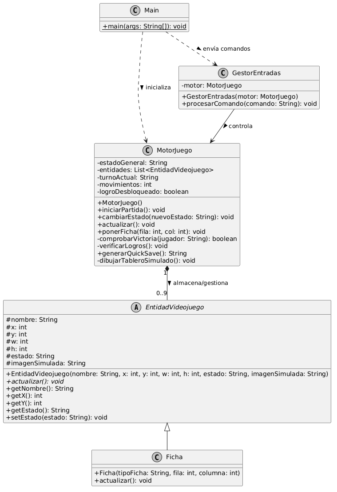

# Parcial3EvCarlosMarmol

# Simulador de Tres en Raya (Tic-Tac-Toe) - Motor de Juego por Consola

Este proyecto consiste en el desarrollo de un motor de videojuego minimalista para el clásico **Tres en Raya (Tic-Tac-Toe)** implementado en Java. La arquitectura está diseñada de forma desacoplada, abstrayendo la lógica del núcleo del juego de la capa de entrada de datos y preparación para una futura interfaz gráfica (GUI).

El sistema simula por consola el ciclo de vida completo de un juego (Game Loop), la gestión de estados, el procesamiento de comandos de usuario, un sistema de logros y la persistencia de datos mediante un sistema de guardado rápido (*Quick Save*).

---

## 🛠️ Arquitectura del Software

La arquitectura del sistema se limita estrictamente a **5 clases**, distribuyendo las responsabilidades mediante un patrón de diseño orientado a entidades y control por estados.

### Justificación de Clases y Responsabilidades

1. **`EntidadVideojuego` (Clase Abstracta):** Es la base del modelo del juego. Se justifica su uso para centralizar las propiedades espaciales comunes de cualquier objeto en pantalla (coordenadas `x`, `y`, ancho `w`, alto `h`), su `estado` dinámico y los recursos visuales (`imagenSimulada`). Esto asegura que el motor sea fácilmente escalable a entornos gráficos como Java Swing o JavaFX.
2. **`Ficha` (Clase Hija):** Extiende de `EntidadVideojuego`. En el contexto del Tres en Raya, representa la ocupación de una casilla por un jugador ('X' o 'O'). Implementa de forma concreta el método `actualizar()` para reportar su presencia estática en el tablero.
3. **`MotorJuego` (Clase Cerebro):** Centraliza el control total. Contiene la máquina de estados (`MENU`, `JUGANDO`, `PAUSA`, `GAME_OVER`), el ciclo de actualización principal (`actualizar()`), la matriz lógica del tablero (gestionada mediante la lista de entidades) y las reglas de negocio (verificación de victoria, empate y desbloqueo de logros).
4. **`GestorEntradas` (InputManager):** Encargado de desacoplar la lectura de comandos de la ejecución del motor. Traduce instrucciones simuladas en formato de texto string (ej. `"PONER_FICHA,1,1"`) en llamadas metodológicas directas hacia el `MotorJuego`.
5. **`Main` (Clase Conductora):** Orquesta la simulación. Alimenta al `GestorEntradas` con una batería de comandos secuenciales para demostrar, sin intervención manual ni bloqueos de lectura, el correcto funcionamiento de todas las directivas técnicas del enunciado.

---

## 🚀 Funcionalidades Implementadas

* **Control de Estado del Juego:** Transiciones lógicas y robustas entre estados, bloqueando acciones de juego si el motor se encuentra en `PAUSA` o `GAME_OVER`.
* **Simulación de Game Loop:** El método `actualizar()` recorre las entidades activas, procesa eventos ambientales e imprime logs de diagnóstico junto con un renderizado textual del tablero en cada iteración.
* **Gestión Dinámica de Entidades:** El motor añade instancias de `Ficha` a su colección interna dinámicamente a medida que los jugadores realizan movimientos válidos.
* **Sistema de Logros:** Monitoreo activo de condiciones de la partida en tiempo de ejecución. Dispara el logro *"Primer de muchos"* de manera automática al colocar la primera pieza.
* **Guardado Rápido Simulado (Quick Save):** Capacidad de exportar el estado exacto de la sesión (estado general, turno, número de movimientos y coordenadas de cada ficha) a una cadena formateada con estructura pseudo-JSON lista para persistencia.

---

## 💻 Instrucciones de Ejecución

1. Clona o descarga el repositorio con la estructura de paquetes correspondiente.
2. Compila los archivos fuentes de Java:
   ```bash
   javac *.java


   
